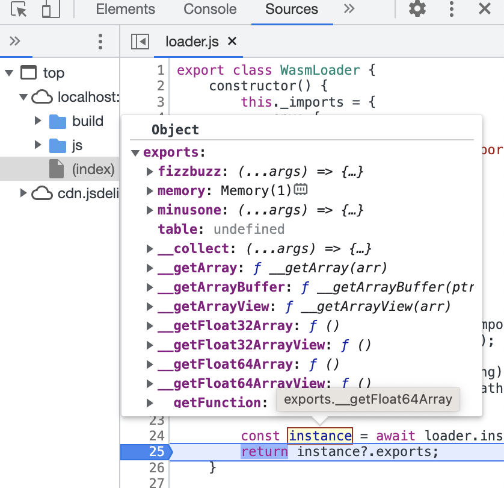

## 5: fizzbuzz wasm

1. the fizzbuzz function

```ts
export function fizzbuzz(n: i32): String | null {
	if (n % 15 === 0) {
		return 'fizzbuzz';
	}
	if (n % 5 === 0) {
		return 'fizz';
	}
	if (n % 3 === 0) {
		return 'buzz';
	}

	return null;
}
```

1. **Problem**: running `fizzbuzz(3)` outputs a number and not a string. The number is a pointer in memory to where the string for `fizz`, `buzz` and `fizzbuzz` are stored. First run `npm run asbuild` then see [`./build/release.wat`](./build/release.wat) for the opcodes

   

1. **Solution**: fortunately assembly has a [loader](https://github.com/AssemblyScript/assemblyscript/tree/main/lib/loader) that lets you allocate and read from memory
1. import the loader to you page

```html
// index.html
<script src="https://cdn.jsdelivr.net/npm/@assemblyscript/loader/umd/index.js"></script>
```

1. in `loader.js` replace the `WebAssembly` method with loader

```js
export class WasmLoader {
	constructor() {
		this._imports = {
			env: {
				abort() {
					throw new Error('Abort called from wasm file');
				},
			},
			index: {
				log(n) {
					console.log(n);
				},
			},
		};
	}

	async wasm(path, imports = this._imports) {
		console.log(`fetching ${path}`);

		if (!loader.instantiateStreaming) {
			return this.wasmFallback(path);
		}

		const { instance } = await loader.instantiateStreaming(
			fetch(path),
			imports
		);
		return instance?.exports;
	}

	async wasmFallback(path, imports) {
		console.log('using fallback');
		const response = await fetch(path);
		const bytes = await response?.arrayBuffer();
		const { instance } = await loader.instantiate(bytes, imports);

		return instance?.exports;
	}
}
```

1. the assemblyscript loader will require internal glue code to be sent with our wasm. add the `--exportRuntime` flag to compile our wasm with these helper functions

```js
// package.json

"asbuild:untouched": "asc assembly/index.ts --target debug --exportRuntime",
"asbuild:optimized": "asc assembly/index.ts --target release --exportRuntime"
```

## using `__getString()` from instance

1. remove the destructure from `const { instance } = ...` to `const instance = await loader.instantiateStreaming(fetch(path), imports);`

1. using the loader this lets us access some useful utility functions like `__getString()`



1.  you can now import the `__getString()` function with takes in a pointer in memory and returns the string

```js
// index.html
const { fizzbuzz, __getString } = instance;
const str = __getString(fizzbuzz(3));
```


