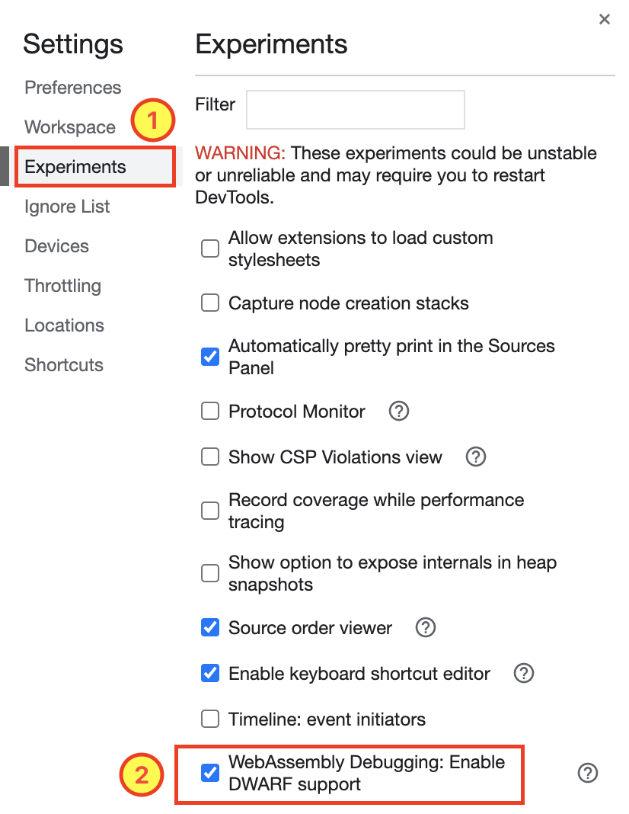

# wasm

1. [intro](./0-intro-wasm/)
1. [nodejs and wasm](./1-nodejs-wasm/)
1. [browser and wasm](./2-browser-wasm/)
1. [imports](./3-imports/)
1. [defining imports (console.log function)](./4-defining-imports/)

## Additional debugging

chrome has build in WebAssembly Debugging experiment setting for debuggin wasm files

> **Note**: it may or may not work
> 

## Resources

Follow along with [this documentation](https://young.github.io/intro-to-web-assembly)
